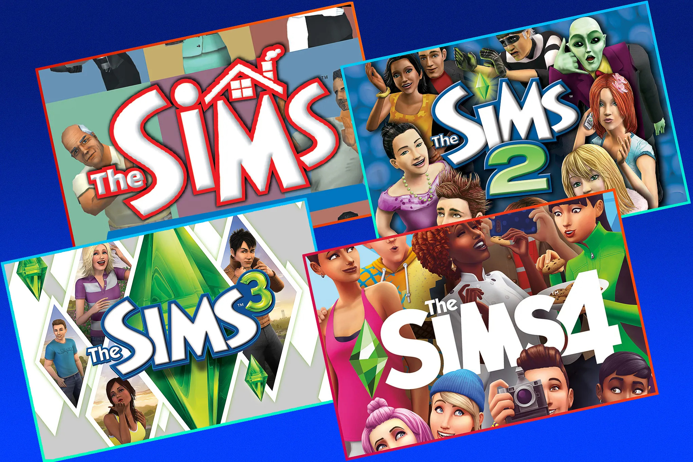
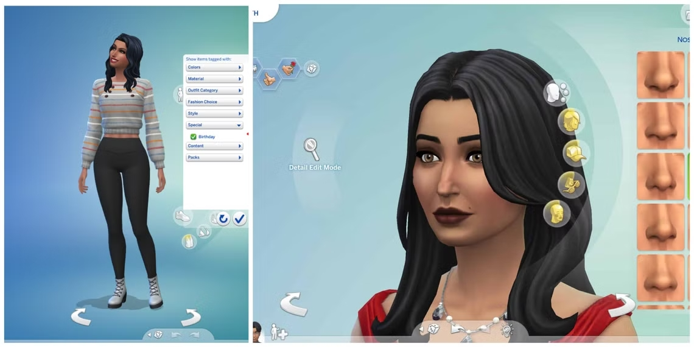

# Los Sims: El Juego que Revolucionó la Simulación de Vida

*Los Sims* es mucho más que un videojuego: es un fenómeno cultural que transformó para siempre el género de simulación de vida. Lanzado en el año 2000 por Maxis y Electronic Arts, fue creado por Will Wright, el mismo desarrollador detrás de *SimCity*. La idea era sencilla pero revolucionaria: en lugar de controlar una ciudad o un imperio, el jugador controlaba personas —sus rutinas, deseos, relaciones, trabajos y hogares— en un entorno virtual.

Lo que hizo único a *Los Sims* fue su flexibilidad: no hay una "forma correcta" de jugar. Podés construir una familia feliz, recrear tu propia vida, vivir fantasías imposibles o incluso causar caos puro. Esta libertad narrativa, combinada con una profunda personalización de personajes y construcciones, marcó un antes y un después en el gaming. La influencia de *Los Sims* se ve hoy en títulos como *Animal Crossing*, *Stardew Valley*, o incluso *Second Life*.

Hasta la fecha, la franquicia ha vendido más de 200 millones de copias a nivel mundial, y sigue vigente gracias a una comunidad activa, contenido descargable (DLCs), mods, y una fuerte presencia en redes sociales y plataformas como YouTube o Twitch.

# La Evolución de la Franquicia

La saga ha pasado por múltiples etapas y versiones, cada una trayendo mejoras y novedades al juego base:

- **Los Sims (2000)**: El original, pionero del género. Incluía necesidades básicas, construcción de casas y relaciones sociales simples.
- **Los Sims 2 (2004)**: Introdujo genética hereditaria, crecimiento generacional, recuerdos y aspiraciones.
- **Los Sims 3 (2009)**: Mundo completamente abierto, personalización profunda de ropa y muebles, y una experiencia más fluida.
- **Los Sims 4 (2014 - presente)**: Mejoras gráficas, sistema de emociones, personalidad más compleja y contenido descargable constante.

Cada una de estas instalaciones de la franquicia vienen acompañadas por numerosos *packs de expansión*, *game packs* y *kits* que amplían las opciones jugables.  
Además de las versiones para PC y consolas, *Los Sims* también tiene versiones móviles. **Los Sims FreePlay** y **Los Sims Mobile** están disponibles para dispositivos Android y iOS, permitiendo a los jugadores disfrutar de una experiencia de simulación de vida en sus celulares. Aunque tienen algunas limitaciones frente a las versiones de escritorio, siguen ofreciendo una experiencia entretenida y accesible.

# ¿Qué Podés Hacer en Los Sims?

El juego ofrece una enorme variedad de experiencias y posibilidades. Algunas de las más comunes incluyen:

## Actividades principales:
- Crear y personalizar Sims: aspecto, ropa, personalidad y aspiraciones.
- Construir y decorar casas desde cero o con planos prediseñados.
- Formar familias, amistades, enemistades y hasta romances complejos.
- Elegir una carrera profesional y subir de nivel en ella.
- Manejar eventos sociales, vacaciones, mascotas y más (según expansión).

## Ejemplos de estilos de juego:
1. **Simulación realista:** Crear tu vida real y ver cómo sería en otro universo.
2. **Estilo arquitecto/diseñador:** Enfocarte en construir casas únicas.
3. **Drama telenovelero:** Triángulos amorosos, infidelidades y venganzas.
4. **Caos puro:** Encerrar Sims en una piscina sin escalera (clásico).
5. **Desafíos comunitarios:** Como el reto de la Legacía (jugar 10 generaciones seguidas).

# Recursos y Comunidad

Si querés saber más o sumarte a la comunidad, estos enlaces te pueden servir:

- [Sitio oficial de Los Sims (EA)](https://www.ea.com/es-es/games/the-sims)
- [Wiki completa de Los Sims](https://sims.fandom.com/es/wiki/Los_Sims_Wiki)
- [Descargar Los Sims 4 gratis](https://www.ea.com/es-es/games/the-sims/the-sims-4/pc/download) *(a veces con packs en promoción)*
- [Reddit de Los Sims: comunidad y contenido](https://www.reddit.com/r/TheSims/)
