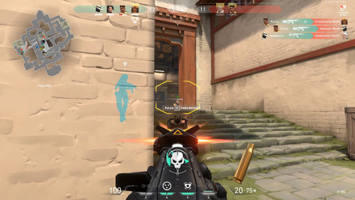
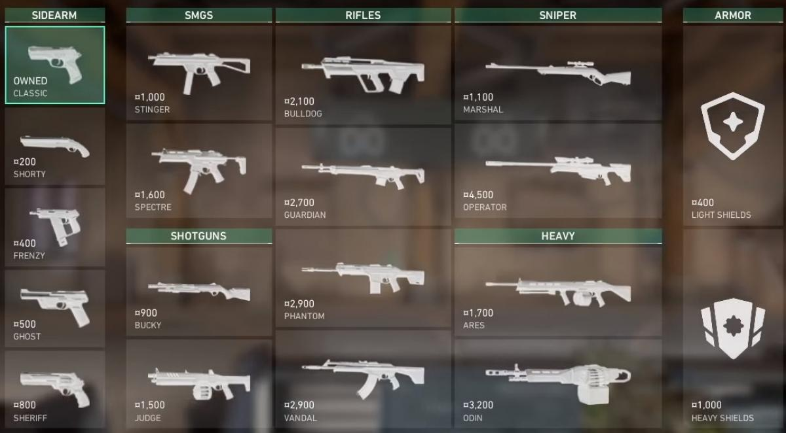
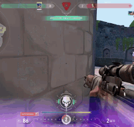

# Valorant:Un gran videojuego
Valorant es un videojuego de disparos en primera persona (FPS) táctico y competitivo, desarrollado y publicado por Riot Games (la misma compañía detrás de League of Legends). 

# Objetivo del juego:
Dos equipos de 5 jugadores se enfrentan en rondas. [Elegir equipo:Agentes](https://www.youtube.com/watch?v=QuOuLIk0vQ0)
Uno de los equipos es atacante y el otro es defensor.
Los **atacantes** deben plantar una bomba llamada Spike en uno de los dos o tres sitios del mapa.
Los **defensores** deben impedirlo o desactivarla si la plantan.
Cada ronda dura un máximo de 1 minuto y 40 segundos, y gana el equipo que logre el objetivo o elimine al equipo contrario.
# La partida:
Seleccionas un agente con habilidades especiales.
Comienza la partida con rondas:
Cada jugador tiene que comprar armas y habilidades al inicio de cada ronda (usando créditos que ganas por jugar).
Si ganas una ronda o haces muchas bajas, recibes más créditos.
Se juega a 13 rondas ganadas, con cambio de roles en la ronda 12 (los que defendían ahora atacan).
Cada personaje tiene su hablididad.Las habilidades son:
- Humos para cubrir visión enemiga.
- Flash para cegar enemigos.
- Granadas o trampas para dañar o ralentizar.
- Curación o resurrección de aliados. Estas habilidades se combinan con el uso de armas, por lo que hay que saber cuándo usarlas tácticamente.
En el siguiente link se ven los diferentes personajes y sus habilidades: [Link personajes](https://playvalorant.com/en-us/agents/)
# Factores clave para ganar
- Puntería y reflejos: Como en otros FPS, disparar con precisión es clave.
- Trabajo en equipo y comunicación: Se gana más fácilmente si los jugadores se coordinan.
- Conocimiento del mapa: Saber por dónde pueden aparecer los enemigos. [Link de diferentes mapas](https://playvalorant.com/en-us/maps/)
- Uso inteligente de habilidades: No basta con disparar, también hay que saber cuándo lanzar una granada o un flash.
## Modos de juego disponibles
Competitivo (clasificatoria): Se juega para subir de rango.
Normal (sin clasificar): Práctica sin presión.
Spike Rush: Partidas cortas (4 rondas).
Deathmatch: Solo para practicar puntería.
Premier: Modo competitivo de equipos preformados.

## ¿Y las armas?
Cada ronda empiezas con dinero y puedes comprar armas (pistolas, rifles, escopetas, etc.).
Si ganas rondas o haces bajas, ganas más dinero para mejorar tus armas y habilidades.
Morir en una ronda significa que pierdes todo lo que llevabas.

# Cosas que debes saber como principiante
- Disparar caminando es malo. Si corres o te mueves, fallas más. Lo mejor es disparar quieto o caminando lento.
- Apunta a la cabeza (headshots). 

  
- Camina con Shift para no hacer ruido.
- Escucha pasos del enemigo. El sonido es clave.
- Practica tu puntería en el campo de tiro. [video de campo de tiro](https://www.youtube.com/watch?v=bXLtfQ_0QIk)
- No gastes habilidades a lo loco. Úsalas con estrategia. [Ejemplo de las habilidades bien usadas](https://www.youtube.com/shorts/wkvIUPshBrE)

## Conclusión:
Valorant es un juego que mezcla precisión, táctica y trabajo en equipo.
No necesitas tener súper reflejos al principio, lo más importante es pensar bien, comunicarte y aprender poco a poco.

Muchos jugadores nuevos se frustran al inicio, pero con práctica y paciencia, se vuelve muy divertido y adictivo.